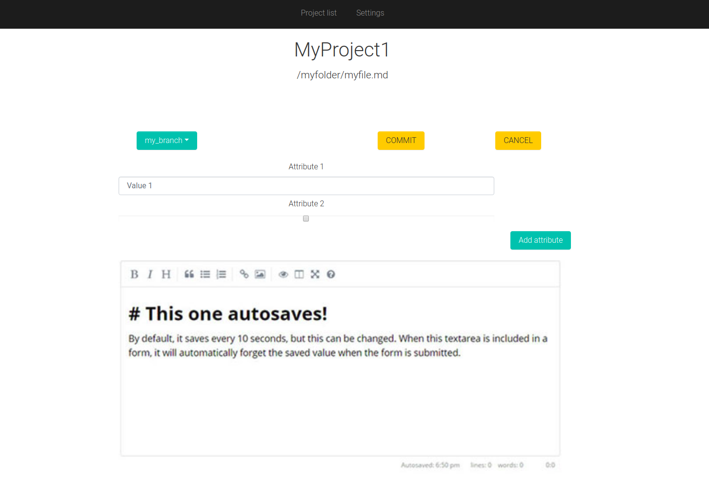
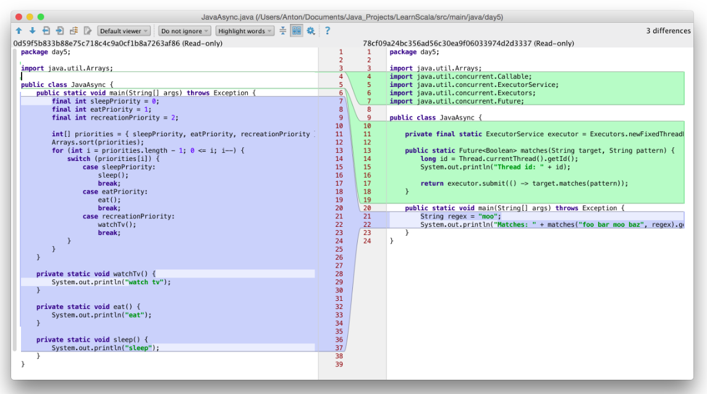

# IDE для markdown

Решение позволяет работать с git репозиторием с markdown файлами в удобном интерфейсе и использовать преимущества оных технологий.

Цель — сделать _инструменты_ для работы с базой знаний/документацией.

Альтернативной является использование IDE наподобие IntelliJ IDEA, Visual Studio и прочих. Но преимуществом данного решения должна быть кроссплатформенность и более лёгкая расширяемость за счёт использования веб-технологий и открытости кода.

Дописать IntelliJ IDEA настолько просто нельзя.

Все существующие веб-IDE и CMS не умеют работать нормально с ветками, а это огромное преимущество. А платформы вроде GitHub/GitLab не предоставляют интерфейсов, понятных не-технарям (по коей причине они популяризируют Confluence).  

# Термины:

Репозиторий — хранилище с материалами

Артефакт — один markdown файл, лежащий в репозитории.

# Функциональные требования

1.  WYSIWYG редактор markdown c возможностью подключения плагинов
1.  Артефакты могут иметь свойства, описанные в соответствии со стандартами markdown, в шапке файла в формате yaml
    1.  Строки
    1.  Енум (см. Extensions)
    1.  Булеан
    1.  Ссылки на другие файлы
1.  WYSIWYG позволяет редактировать свойства Артефактов
1.  IDE должна позволять подключать-отключать extension-ы к проектам
1.  Настройки IDE хранятся локально
1.  IDE должна работать локально, на desktop-е, даже в отсутствии интернета (это очень актуально для людей в «режимных» организациях и в госах)
1.  diff веток
1.  решение конфликтов при пушах-пуллах-мерджах
1.  должна поддерживаться вставка картинок из визивига
1.  должна поддерживаться загрузка картинок из визивига

# Интерфейсы

## Главный экран

Позволяет выбрать проект.

## Экран проекта

Показываем выпадашку с ветками и кнопки:

*   Пуш
*   Пулл
*   "Сравнить с мастером", если мы не в мастер-ветке
*   И одна из двух кнопок, если мы не в мастере:
    *   "Влить в мастер" если мы обгоняе мастер
    *   "Влить мастер сюда", если мастер нас обгоняет


## Экран файла

Отображает файл в режими WYSIWYG.

У каждого файла есть аттрибуты, их можно редактировать. добавлять и убирать, изменяя набор полей.



## Экран сравнения с мастером

В идеале - должен повторять интерфейсы IntelliJ IDEA, что-то типа такого:



## Экран мерджа с конфликтами

В идеале - должен повторять интерфейсы IntelliJ IDEA.

# Extension #0: enum значения

- enum значения
- Варианты enum значений должны храниться в файлах .docs/<названиесвойства>. Так, если у вас есть свойство type – должен быть файл .docs/type с текстом, например

```
article
contact
known bug
```

На коммите enum значения должны валидироваться (делается с помощью гит-хуков, например).

# Extension #1: контроль ссылок

На коммите контролирует ссылки.

- Валидирует, что внутренние ссылки не побились
- Валидирует внешние ссылки
- Автоматически генерирует магическое свойство «на этот документ ссылаются из ХХХ»
- В интерфейсах красиво отображает «на этот документ ссылаются из ХХХ»

# Extension #2: быстрое создание новых артефактов

Прямо со страницы просмотра одного Артефакта можно создавать новые Артефакты. Они сразу создаются связанными.

Например, так можно разбивать Требования на Тезисы.

Пользователь может выделить текст и создать на основе него новый Артефакт.

Возникающий в таком случае попап спрашивает пользователя, как кратко назвать тезис. После ввода названия внизу страницы создаётся тезис, информацию о котором пользователь может пополнить.

# Extension #3: поиск

добавляем строку поиска в интерфейс. Он позволяет искать по маркдаун файлам (к сожалению, без морфологии и тем более без учёта смысла) и <span style="text-decoration:underline;">поддерживает поиск по аттрибутам</span>, подобно тому, как это сделано в слаке/гитлабе.

# Архитектура

Строго необходимо разделить публичную часть (редактор) и хранилище, работающее с гитом — они должны общаться по http, через задокументированное API.

Причина: существует множество движков git с разными кастомизациями, и они по-разному работают с разным объёмом/количеством файлов. Это действительно критичная проблема на тяжёлых операциях.

И фронтэнд и бэкэнд должны запускаться на desktop-е.

Этого можно достигнуть с помощью «обычных» технологий, например, публичку сделать на React, а бэкэнд общающийся с гитом — на python.


## Фронтэнд часть на React:

- WYSIWIG редаткор =[ https://github.com/GitbookIO/react-rich-diff](https://github.com/GitbookIO/react-rich-diff)
- сравнение двух маркдаунов =[ https://github.com/GitbookIO/react-rich-diff](https://github.com/GitbookIO/react-rich-diff)<br/>
[https://github.com/jpreynat/slate](https://github.com/jpreynat/slate)<br/>
См [ https://github.com/jpreynat/slate/tree/master/examples/markdown-shortcuts](https://github.com/jpreynat/slate/tree/master/examples/markdown-shortcuts) и[ https://github.com/jpreynat/slate/tree/master/examples/markdown-preview](https://github.com/jpreynat/slate/tree/master/examples/markdown-preview)
- отображение дерева файлов — не искал, но наверняка тысячи их


## Бэкэнд на питоне:

я могу сесть и написать за несколько вечеров


## Апи:

Был бы повод - можно и нужно написать за вечер.